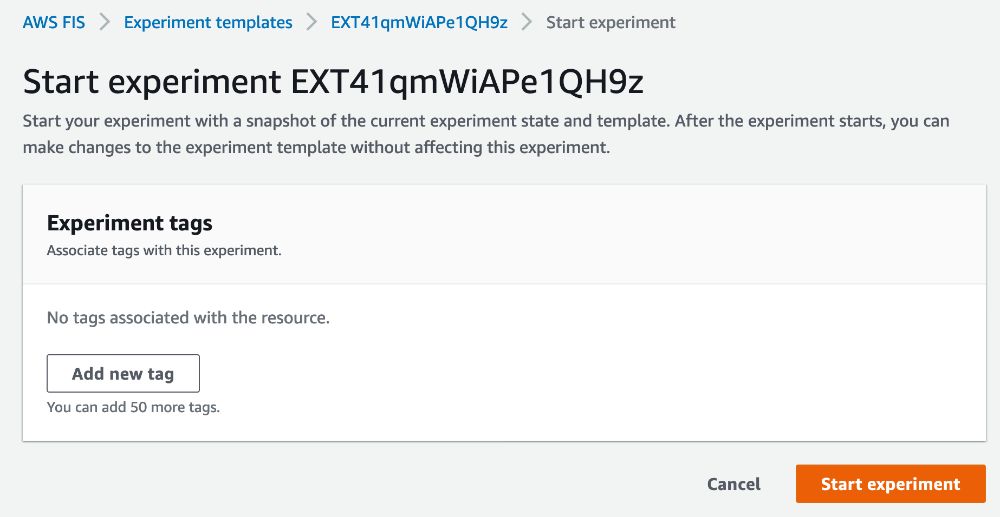
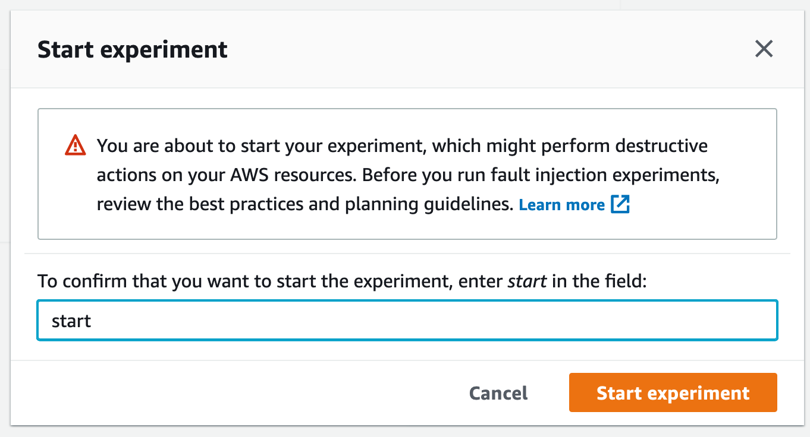
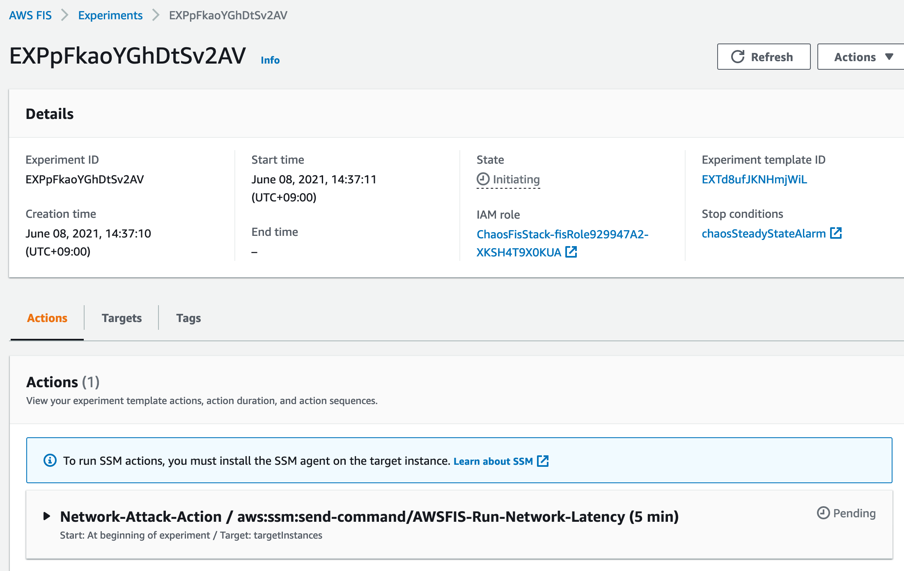
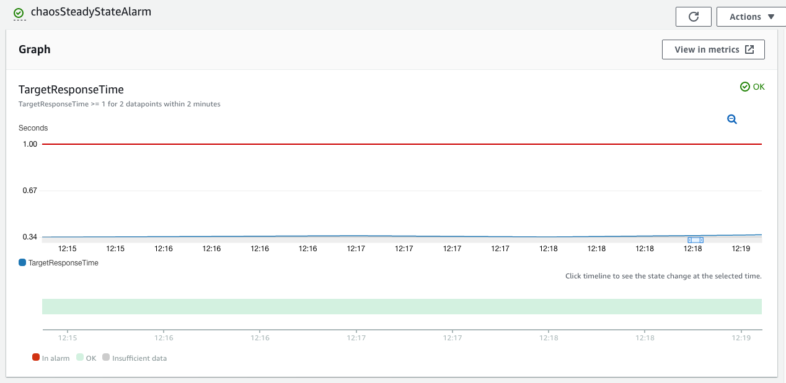
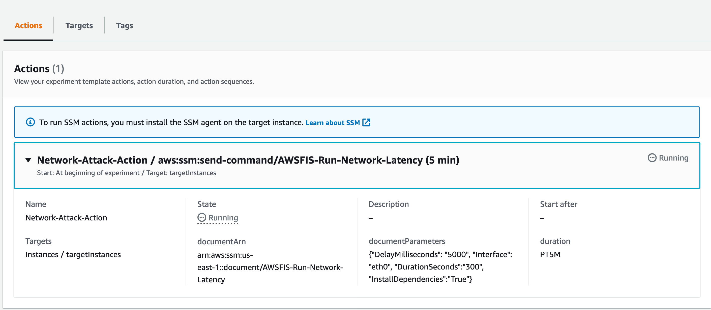
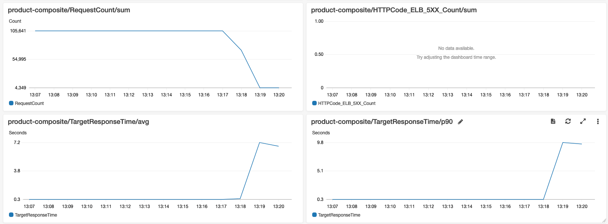
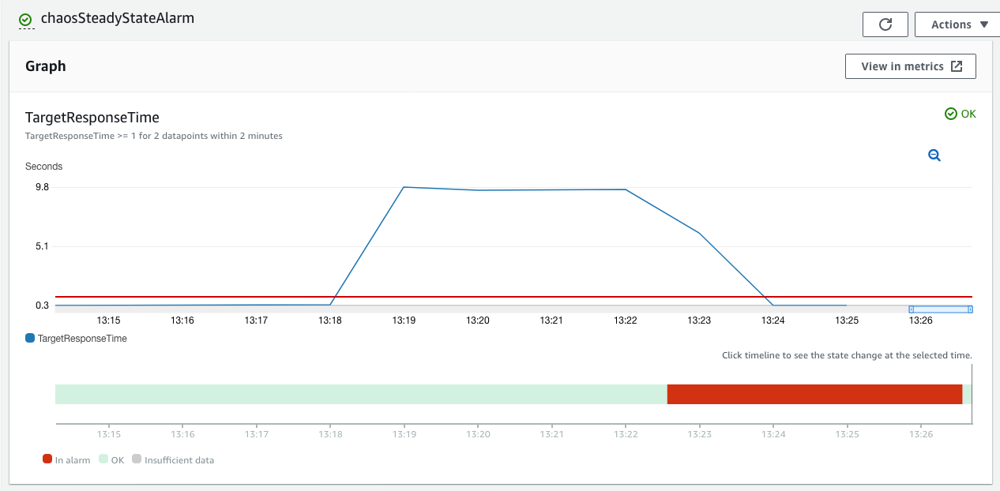
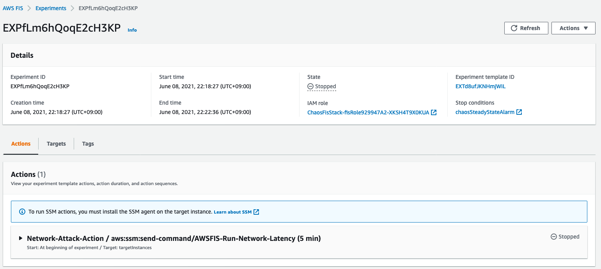

## 실험 -  네트워크 지연 공격

실험을 위해 recommendation 서비스에서 사용하는 EC2 인스턴스 2대에 네트워크 지연을 발생시킵니다.

AWS 콘솔에서 FIS Service로 이동하고 좌측 메뉴에서 **Experiment templates** 메뉴를 선택합니다.

미리 생성된 Network Attack Template을 선택하고 Actions에서 **Start experiment** 메뉴를 클릭합니다.

다음 화면에서 **Start experiment** 버튼을 클릭합니다.

경고문구를 확인하고 `start` 를 입력하고 **Start experiment** 버튼을 다시 한번 클릭합니다.

이제 recommendation 서비스에서 사용하는 EC2의 네트워크에 대하여 공격이 시작됩니다.

Details 에 Stop Conditions이 설정된 것을 확인할 수 있습니다.

링크를 클릭하면 CloudWatch Alarm 알람으로 정상상태(p90 1초 이내의 상품정보 API 응답처리시간)를 의미하는 TargetResponseTime p90가 1초로 설정된 것을 볼 수 있습니다.

Actions 탭을 살펴보면 공격은 5분간 지속되며, 네트워크에 5초(5000ms)의 지연을 주입하는 것을 확인할 수 있습니다.

Targets 탭을 살펴보면 실제 어떤 EC2가 공격대상인지 조건을 확인할 수 있습니다.

---

## 실제결과 확인

이제 Amazon CloudWatch에 만들어졌던 Dashboards를 통해서 모니터링 해보겠습니다. recommendation 서비스에 네트워크 지연이 발생하자, 이를 호출하는 product-composite 서비스에 지연이 발생하고 API 응답시간에 지연이 발생합니다.

지연이 계속되자 시스템이 정상상태(p90 1초 이내의 상품정보 API 응답처리시간)를 벗어나서 CloudWatch 알람이 발생하였습니다.

FIS에 Stop conditions으로 설정된 CloudWatch 알람으로 인해 공격이 중단되었습니다.

공격의 중단으로 서비스는 다시 정상화 되었습니다.

